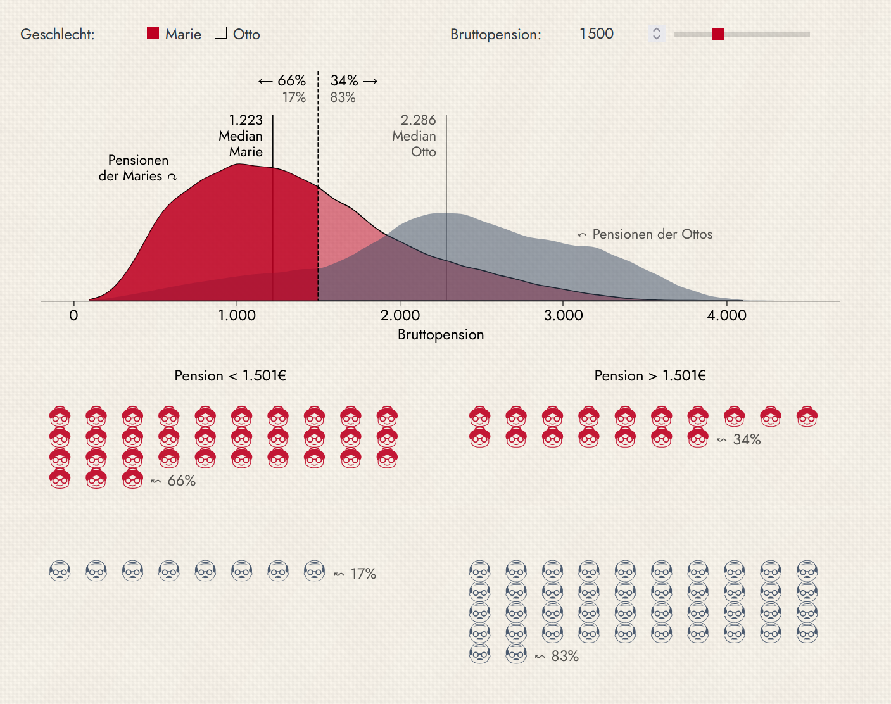

# Gender Pension Gap in Austria

An interactive data visualization of the **gender pension gap in Austria**, showing how women's pensions systematically fall below men's across the full distribution — from the median to the extremes. The visualization combines a pension distribution chart, an ISOTYPE-style count graphic, and a decile comparison (dumbbell chart), all based on WIFO microsimulation data.

> Submitted to the [Marie Neurath Prize for Data Visualization 2025](https://wien.arbeiterkammer.at/neurath), awarded by the Austrian Chamber of Labour (Arbeiterkammer Wien).

**Live:** [https://data-science.wifo.ac.at/marie-neurath](https://data-science.wifo.ac.at/marie-neurath)

## About Marie Neurath

Marie Neurath (1898-1986) pioneered visual knowledge communication at Vienna's Society and Economic Museum (from 1924), collaborating with Otto Neurath and Gerd Arntz. After fleeing Nazi Austria, she co-founded the ISOTYPE Institute in Britain, directing it from 1945-1971 to advance accessible information design.

## Data

The pension distribution data (`data/`) is derived from:

Eppel, R., Fink, M., Horvath, T., Mayrhuber, C., & Rocha-Akis, S. (2024). *Simulation von Änderungen des Pensionssystems auf die Höhe der Alterseinkommen und den Gender Pension Gap in Österreich.* WIFO – Österreichisches Institut für Wirtschaftsforschung. [https://www.wifo.ac.at/publication/270945/](https://www.wifo.ac.at/publication/270945/)

Visualizations were commissioned by the Kammer für Arbeiter und Angestellte für Oberösterreich (Mayrhuber, C., Grandner, L., & Schmoigl, L., 2024). [https://www.wifo.ac.at/project/427208/](https://www.wifo.ac.at/project/427208/)

## Links

- [Marie Neurath Prize for Data Visualization](https://wien.arbeiterkammer.at/neurath)